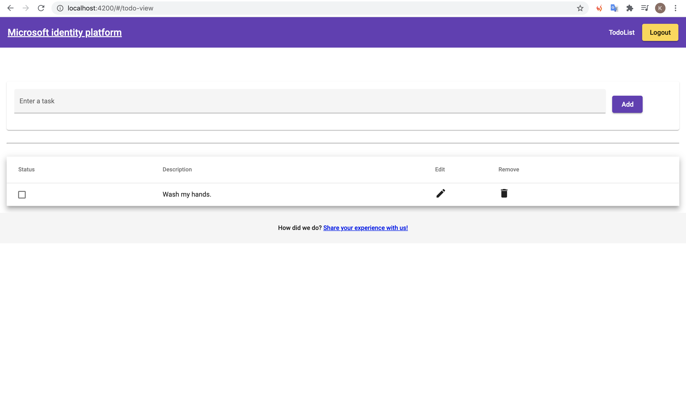

# Azure Blob Storage にホストした静的 Web サイトに対して認証・認可機能を実装する

## 目的

- 静的 Web サイトに認証・認可機能を実装し、全体の流れを把握する。

## 前提

- 今回は、サンプルとして、ローカルで実行する。

## 背景

- Azure App Service Web Apps であれば、EasyAuth にて Azure AD との認証を自動的に行ってくれるが、静的 Web サイトではそうしたことは不可能である。
- Azure Static Web Apps であれば、認証機能が存在する。（[参考](https://docs.microsoft.com/ja-jp/azure/static-web-apps/authentication-authorization)）
- 静的 Web サイトでは、MSAL (Microsoft Authentication Library) を使って認証を行い、取得したトークンにより認可を行うまでの流れをコードで書く必要がある。

## 結論

1.  静的 Web サイトを Blob でホスティングする場合、SPAで認証するためには、 MSAL.js を使って SPA 側に認証機能を作りこむ必要がある（Azure AD の機能のみで認証をするのは不可能）。
2.  取得した JWT を Web API 側で検証するため、フロントエンドでリクエストヘッダにアクセストークンをのせたリクエストを送信し、バックエンドで Microsoft IdentityModel Extensions for .NET を使用してトークンを検証する必要がある。

## サンプルアプリケーション画面

- トップページ


- ログイン後画面


- タスク追加画面


- タスク確認画面


## 認証アーキテクチャ
Azure AD を用いた認証アーキテクチャは下図の通り。フロントエンド、バックエンドともに Azure AD Application に登録し、バックエンドにて適切なスコープのもと、 API の公開を行う。フロントエンドでは、API アクセス許可を設定し、必要な権限を保持する。


## 手順

サンプルアプリケーションの実行方法は[こちら](https://github.com/Azure-Samples/ms-identity-javascript-angular-tutorial/tree/main/3-Authorization-II/1-call-api#setup)を参照すること。

フロントエンド実行。
```shell
> npm install

> npm start
```

バックエンド実行。

```shell
> dotnet restore
  復元対象のプロジェクトを決定しています...
  復元対象のすべてのプロジェクトは最新です。
> dotnet dev-certs https --clean
Cleaning HTTPS development certificates from the machine. A prompt might get displayed to confirm the removal of some of the certificates.
HTTPS development certificates successfully removed from the machine.
> dotnet dev-certs https --trust
Trusting the HTTPS development certificate was requested. A confirmation prompt will be displayed if the certificate was not previously trusted. Click yes on the prompt to trust the certificate.
The HTTPS developer certificate was generated successfully.
> dotnet run
```

<b>★↓要修正</b>

JWT を取得してから Web API からレスポンスが返ってくるまでの動作イメージは下図の通り。


## Microsoft Identity Platform とは

次のようないくつかのコンポーネントで構成される、認証プラットフォーム。

- 開発者が次のような種類の ID を認証できるようにする OAuth 2.0 および OpenID Connect 標準準拠の認証サービス
  - 職場または学校のアカウント (Azure AD を通じてプロビジョニングされます)
  - 個人用 Microsoft アカウント (Skype、Xbox、Outlook.com など)
  - ソーシャル アカウントまたはローカル アカウント (Azure AD B2C を使用)
- オープンソース ライブラリ:Microsoft Authentication Libraries (MSAL) およびその他の標準準拠ライブラリのサポート
- アプリケーション管理ポータル:Microsoft Azure portal 上での登録および構成エクスペリエンスと、その他の Azure 管理機能。
アプリケーション構成 API および PowerShell:Microsoft Graph API および PowerShell を使用した、プログラムによるアプリケーションの構成。これにより、DevOps タスクを自動化できます。
- 開発者向けコンテンツ:クイックスタート、チュートリアル、攻略ガイド、コード サンプルなどの技術ドキュメント。

([ドキュメント](https://docs.microsoft.com/ja-jp/azure/active-directory/develop/v2-overview)より抜粋)

## JWT (JSON Web Token) とは

認証用トークン。`ヘッダ`、`ペイロード`、`署名`の 3 要素から構成される。<br>
それぞれ Base64 でエンコードされており、各構成要素が `. (ドット)` で結合されている。<br>

```
eyJ0eXAiOiJKV1QiLCJhbGciOiJSUzI1NiIsImtpZCI6Im5PbzNaRHJPRFhFSzFqS1doWHNsSFJfS1hFZyJ9.eyJhdWQiOiIx

・・・（省略）・・・

jAifQ.MRGdtxWqPwiZltcsvml2Y95EHuXsJsQkh-R2ThQ-PJLeZxFhFc_A_wm_I8kC82FQTMxmtfzjmF9o0-SPa0Hq6o4・・・（省略）・・・
cVNoVEJc1U8m-oRdcQAtlrEynWqSRqP3rO_kk1XE7-PQEUUk3lok5nuYmmscqf8zSV3KwhKfMEuFOUWrA
```

取得した値を[こちら](https://jwt.io/)のサイトででコードすると、上記の構成になっていることがわかる。


ペイロードの各項目のことを<b>クレーム</b>と呼ぶ。クレームの一例は下記の通り。

|クレーム|	説明|
| :----: | ---- |
|iss |	JWT発行者|
|sub |	JWT発行者から払い出されたユーザ識別子。文字列またはURIで表わされる。⇒社員番号を設定|
|aud |	JWTを利用することが想定された主体の識別子一覧|
|exp |	JWTの有効期限を示す。|
|nbf |	JWTが有効になる日時を示す。|
|iat |	JWTを発行した時刻を示す。
|jti |	JWTのための一意な識別子。JWTのリプレイを防ぐことに利用する。|
|typ |	typヘッダパラメータと同じ値空間および同じ規則が適用される。|


## Azure AD アプリケーションオブジェクトとは [WIP]

Azure で アプリケーションを利用する場合、Azure AD に対してアプリケーションの定義を登録する必要がある。 Azure AD では、アプリケーションの定義をアプリケーションオブジェクトとして定義する。

## フロントエンドで JWT を取得する方法

フロントエンド (JavaScript) で、MSAL.js を使用して、Azure AD から JWT を取得する方法を確認する。

### MSAL.js ライブラリ

Microsoft Identity Platform の認証機能を使用するための JavaScript ライブラリとして、 Microsoft Authentication Library for JavaScript (MSAL.js) が用意されている。<br>
このライブラリでは、ユーザをサインインさせ、 Microsoft ID Platform によって保護された API へのアクセスに使用されるトークンをリクエストする。<br>
サンプルプログラムの `index.html` には、このライブラリへの参照が含まれている。

```html:index.html
  <script src="https://alcdn.msauth.net/browser/2.13.1/js/msal-browser.js"
    integrity="sha384-7hwr87O1w6buPsX92CwuRaz/wQzachgOEq+iLHv0ESavynv6rbYwKImSl7wUW3wV"
    crossorigin="anonymous"></script>
```

取得した JWT は、下図の通りブラウザ上で確認可能。


## C# による JWT の検証

取得した JWT をバックエンドに渡す際は、クライアント側で取得した JWT をリクエストヘッダに加え、バックエンド側で検証を行う。

### JWT Bearer configuration
 
```json:appsettings.json
{
  "AzureAd": {
    "Instance": "https://login.microsoftonline.com/",
    "Domain": "microsoft.onmicrosoft.com",
    /*
      You need specify the TenantId only if you want to accept access tokens from a single tenant
     (line-of-business app).
      Otherwise, you can leave them set to common.
      This can be:
      - A GUID (Tenant ID = Directory ID)
      - 'common' (any organization and personal accounts)
      - 'organizations' (any organization)
      - 'consumers' (Microsoft personal accounts)
    */
    "TenantId": "common",
    "ClientId": "xxxxxxx-xxxx-xxxx-xxxx-xxxxxxxxxx"
  },
  "https_port": 44351,
  "Logging": {
    "LogLevel": {
      "Default": "Information",
      "Microsoft": "Warning",
      "Microsoft.Hosting.Lifetime": "Information"
    }
  },
  "AllowedHosts": "*"
}
```

### Code Initalization

`[Authorize]` 属性を保持するコントローラアクションが呼び出されると、ASP.NET と ASP.NET Core により、Authorization ヘッダーの Bearer Token からアクセストークンが抽出される。<br>
アクセストークンは、 JwtBearer ミドルウェアに転送され、Microsoft IdentityModel Extensions for .NET が呼び出される。

### ASP.NET Core 3.1 アプリケーションのサンプルを確認する

Azure Active Directory との認証統合をサポートする型として、`Microsoft.AspNetCore.AzureAD.UI` ライブラリが使用されている。<br>
このミドルウェアは、 `Startup.cs` で初期化される。

```C#:Startup.cs
using Microsoft.AspNetCore.Authentication.JwtBearer;
```

```C#:Startup.cs
    ・・・
    　　  services.AddAuthentication(AzureADDefaults.JwtBearerAuthenticationScheme)
             .AddAzureADBearer(options => Configuration.Bind("AzureAd", options));
    ・・・
```
Microsoft ID Platform では、 OAuth 2.0 承認プロトコルが実装されている。<br>
OAuth 2.0 は、ユーザに代わって、サードパーティアプリケーションが Web でホストされているリソースにアクセスできる方法である。<br>
Web でホストされるリソースは一意のリソース識別子（=<b>アプリケーション ID URI</b>）を持つ。各リソース識別子ごとにアクセス許可を定義することで、 API 公開の仕方を細かく制御することができる。

リソースごとにアクセスを細かく制御できるのはよいが、一つ一つ制御していると、膨大な数の API を利用する際に設定が煩雑になる。よって、ある程度アクセス可能なリソースの範囲をまとめて、アクセス可能なリソースを制限するやり方がある。これを OAuth 2.0 では<b>スコープ</b>と呼ぶ。

アプリケーションでは、Microsoft ID Platform 認可エンドポイントへのリクエストでスコープを指定することにより、アクセス許可を要求する。

API に対するスコープの設定は、Azure Portal からは下記のように可能。

[Azure Active Directory] > [アプリの登録] > [公開する API を持つアプリケーションの選択] > [API の公開] > [Scope の追加]


C# では、以下のように、適切なスコープを持っているかを確認することができる。

```c#:TodoListController.cs
    ・・・
        // The Web API will only accept tokens 1) for users, and 
        // 2) having the access_as_user scope for this API
        static readonly string[] scopeRequiredByApi = new string[] { "access_as_user" };
    ・・・
```

`VerifyUserHasAnyAcceptedScope` メソッドにおいて、リクエストが API で想定されるスコープを含む値を持っていることを確認する（[参考](https://docs.microsoft.com/en-us/dotnet/api/microsoft.identity.web.resource.scopesrequiredhttpcontextextensions.verifyuserhasanyacceptedscope?view=azure-dotnet-preview)）。

```c#:TodoListController.cs
    ・・・
        // GET: api/TodoItems
        [HttpGet]
        public async Task<ActionResult<IEnumerable<TodoItem>>> GetTodoItems()
        {
            HttpContext.VerifyUserHasAnyAcceptedScope(scopeRequiredByApi);
            string owner = User.FindFirst(ClaimTypes.NameIdentifier)?.Value;
            return await _context.TodoItems.Where(item => item.Owner == owner).ToListAsync();
        }
    ・・・
```

クライアントアプリケーションには、バックエンドの API に対するアクセス許可を与える必要がある。


## 参考

- [チュートリアル:ユーザーをサインインして、JavaScript シングルページ アプリケーション (SPA) から Microsoft Graph API を呼び出す](https://docs.microsoft.com/ja-jp/azure/active-directory/develop/tutorial-v2-javascript-spa)
- [Microsoft Authentication Library (MSAL) の概要](https://docs.microsoft.com/ja-jp/azure/active-directory/develop/msal-overview)
- [Azure Storage で静的 Web サイトをホストする](https://docs.microsoft.com/ja-jp/azure/storage/blobs/storage-blob-static-website-how-to?tabs=azure-portal)
- [Microsoft ID プラットフォームでのアクセス許可と同意](https://docs.microsoft.com/ja-jp/azure/active-directory/develop/v2-permissions-and-consent)
- [認証フローとアプリケーションのシナリオ](https://docs.microsoft.com/ja-jp/azure/active-directory/develop/authentication-flows-app-scenarios)
- [シングルページ アプリケーション：アプリの登録](https://docs.microsoft.com/ja-jp/azure/active-directory/develop/scenario-spa-app-registration)
- [クイックスタート: PKCE 対応の承認コード フローを使用して JavaScript SPA 内でユーザーをサインインさせ、アクセス トークンを取得する](https://docs.microsoft.com/ja-jp/azure/active-directory/develop/quickstart-v2-javascript-auth-code)
- [保護された Web API: コード構成](https://docs.microsoft.com/ja-jp/azure/active-directory/develop/scenario-protected-web-api-app-configuration)
